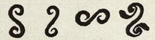
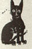

Statistical analysis on the addition of five symbols to the corpus of
the cretan hieroglyphs
================
Davide Facchinelli
31/07/2019

``` r
library(tolerance)
```

# Introduction

We try to understand if adding or not five symbols to the set of symbols
classically considered (see Jean-Pierre Olivier 1996) in the corpus of
the cretan hieroglyphs is a good idea or not.

The new symbol considered are the followings, to which we associate a
specific id:

 id 207

 id 208

 id 210

 id 211

 id 212

(The images are taken from Evans 1909)

To do so we conduct a statistical analysis in the corpus adding or not
our extra symbol. From the literature about statistical analysis of
natural language we expect to find some specific results. We will decide
that inserting the new symbol is a good idea if doing so we obtain a
result more similar to the expected one.

# Theoretical background

To be more specific, we know from the literature (see Piantadosi 2014)
that the word’s frequencies in a natural language follow a specific
distribution. In general, it has been observed that many data coming
from the real world follow a power law (see Aaron Clauset 2009), and in
particular the natural language’s world frequencies. Two models have
been proposed historically, before the Zipf’s law (see Zipf 1936) and in
a second moment the more precise Zipf-Mandelbrot law (see Mandelbrot
1953). We will conduct our analysis for both. We compute the frequencies
of each word and assign to them a rank based on how frequently they
appear (the most common will be labelled as one, the second most common
as two, etc.).

### Zipf’s law

It has been observed that the word of rank
 appears in a natural
language with a frequency proportional to
 where
 is a
parameter dependent on the language with a value around
.

### Zipf-Mandelbrot’s law

This second version of the initial idea of Mandelbrot introduces a small
correction. Now it is stated that the word of rank
 appears in a natural
language with a frequency proportional to
^\\alpha}") where
 and
 are two
parameters dependent on the language.

# Data and functions

We import the data from a file we built before. That is, we have a count
of how many times a symbol (codified with an id) appears. This count is
weighted: when in the corpus (see Jean-Pierre Olivier 1996) the authors
were not sure of which symbol they were observing, we counted the symbol
 times instead of
.

``` r
df = read.csv('freq0.8.csv', header = F)
```

Let us define our Zipf and Zipf-Mandelbrot functions for later use.

``` r
# we assume that rs is provided as a vector of ranks
zipf = function(rs,alpha){
  n = length(rs)
  a = 1/(rs^alpha)
  a = a/sum(1/((1:n)^alpha))
  return(a)
}


zipfm = function(rs,alpha,beta){
  n = length(rs)
  a = 1/((beta+rs)^alpha)
  a = a/sum(1/((beta+(1:n))^alpha))
  return(a)
}
```

# Analysis

We are going to do the following. We fix a corpus and on this one we
estimate the best fitting
 (and
eventually ) constant. Done this, we get a quantitative measure of how
well our data fit the Zipf’s (or Zipf-Mandelbrot’s) law.

To be a little more detailed, we are going to estimate our parameters
via an MLE estimation, and use the adjusted
 index on the
logarithmically scaled data to evaluate how well we are fitting our
data. We choose to use the adjusted
 index even if
there are other more precise meter of evaluation as it has been largely
used in the literature (see for example Yu Shuiyuan 2018). We will say
that we should insert a new symbol in the new corpus if doing so we
increase the goodness of fit of our law of reference.

In addition to these, we are going to check if our results have to be
trusted. It is totally possible that the difference we observe is due to
the innate randomity of the phenomena. To do so we provide a measure of
how different the dataset is adding the new symbol, and if it’s
reasonable to consider it a significant addition.

To do so we are going to do a two sample test. We are going to use the
one proposed in an article of Alessandro Bessi (see Bessi 2015) that
define a hypothesis testing for the specific situation we are in. He has
shown that the log-likelihood ratio between the likelihood of the union
of the two dataset and the product of the likelihood of the two dataset
separated should follow a

distribution under the null hypothesis (that is, that the two dataset
comes from the same distribution). He used it in the context of the
Zipf’s law, but extending it to the Zipf-Mandelbrot’s law is immediate
thanks to the Wilks’ theorem (see Wilks 1938). It is enough to consider
not a  distribution with one degree of freedom, but one with two.

From this test we will finally estimate a p-value, a measure of how much
it is probable that the difference we observe is not significative and
due to fluctuations. Classically in a situation like this a threshold of
 is imposed,
and we do not see any reason to change that. That is, if our p-value is
under  we will
reject the null hypothesis and conclude that adding our symbol is
significative.

We need to remark that both the MLE estimators and the Wilk’s theorem
are asymptotic instruments. That is, using them in practical context
will always force us to do an approximations, but this approximation
became insignificant when we deal with very large dataset. In our case
we have a rather small dataset at hand, therefore the approximation
error in our analysis may be quite big, making our analysis unreliable.

### Code preparation

We define the different functions to be used
later.

``` r
ana = function(exclist = c(211,207,210,212,208), model, print = TRUE, fig = FALSE){ # model can be either 'Zipf' or 'Zipf-Man'
  req = df[!(df$V1 %in% exclist),]
  samp = c()
  for (i in 1:length(req[,1])) samp = c(samp, rep(i,round(req[i,2])))
  
  out = zm.ll(samp, dist = model)
  coefficients = stats4::coef(out)
  if(print) show(coefficients)
  if(print) show(c(sd = diag(stats4::vcov(out))))
  
  x = (1:length(req[,1]))
  y = req[,2]/sum(req[,2])
  if(model == 'Zipf'){
    f = zipf(x,coefficients[1])
  }
  else f = zipfm(x,coefficients[1],coefficients[2])
  
  if(print) show(c(mse = mse(y,f)))
  R2 = cor(log(y),log(f))^2
  n = length(x)
  adj.R2 = 1-(1-R2)*(n-1)/(n-2)
  if(print) show(c(R2 = R2))
  if(print) show(c(adj.R2 = adj.R2))
  
  if(fig){
    plot(x,y,type = 'p', lwd = 2.5,xlab = 'Rank', ylab = 'Frequency', main = model)
    lines(x,f, type = 'l', lwd = 2.5,col = 'red')
    cat('\n\n')
    plot(log(x),log(y),type = 'p', lwd = 2.5,xlab = 'Rank', ylab = 'Frequency',main = paste(model,"in log scale"))
    lines(log(x),log(f), type = 'l', lwd = 2.5,col = 'red')
  }
  return(adj.R2)
}

two.sample.test = function(ex1,ex2, model){ # we assume that s1 contains s2
  
  req1 = df[!(df$V1 %in% ex1),]
  s1 = c()
  for (i in 1:length(req1[,1])) s1 = c(s1, rep(i,round(req1[i,2])))
  
  req2 = df[!(df$V1 %in% ex2),]
  s2 = c()
  for (i in 1:length(req2[,1])) s2 = c(s2, rep(i,round(req2[i,2])))

  uni = c(s1,s2)
  
  ll.uni = as.numeric(stats4::logLik(zm.ll(uni, dist = model)))
  ll.s1 = as.numeric(stats4::logLik(zm.ll(s1, dist = model)))
  ll.s2 = as.numeric(stats4::logLik(zm.ll(s2, dist = model)))
  if(model == 'Zipf')degf = 1
  else degf = 2
  return(1-pchisq(2*(ll.s1+ll.s2-ll.uni),degf))
}

piper = function(ex = c(211,207,210,212,208), model){
  for (s in ex){
    cat('\n\n')
    print('We add the symbol')
    print(s)
    show(c(adj.R2.classic.dataset = ana(print=FALSE, model = model), adj.R2.new.dataset = ana(model = model, exclist = ex[!(s == ex)],print = FALSE)))
    show(c(p.value.statistical.difference.in.dataset = two.sample.test(ex,ex[!(s == ex)],model = model)))
  }
}
```

### Introductory analysis

We estimate our parameters for the classic corpus and plot the curve
that we obtain in this way. We will plot both the original relative
frequencies (as black dots) and the estimated distribution (as a red
line). we will plot both the normal curves and the log-scaled one, for
both the Zipf’s law and the Zipf-Mandelbrot’s
law.

``` r
ignore = ana(model = 'Zipf', fig = TRUE, print = FALSE)
```

<!-- -->

<!-- -->

``` r
ignore = ana(model = 'Zipf-Man', fig = TRUE, print = FALSE)
```

<!-- -->

<!-- -->

We can clearly see that the Zipf-Mandelbrot’s law explain our
observation a lot better than the classic Zipf’s law.

### Results

First let us summarize what we said up to now. We are going to compute
for each symbol three values: the adjusted
 value for both
the classical corpus, the one to which we added the new symbol and the
p-value of our statistical significant test. We will say that the
dataset with the greatest adjusted
 is the
preferred one, so if the second get a greatest adjusted
 we should
consider the symbol as part of the dataset. The p-value tells us if the
result is reliable, that is, we can consider significative what we
obtain comparing the adjusted
 values only if
our p-value falls under
.

Let us see what we get for the Zipf’s law.

``` r
piper(model = 'Zipf')
```

    ## 
    ## 
    ## [1] "We add the symbol"
    ## [1] 211
    ## adj.R2.classic.dataset     adj.R2.new.dataset 
    ##              0.9069816              0.9076431 
    ## p.value.statistical.difference.in.dataset 
    ##                                0.01644012 
    ## 
    ## 
    ## [1] "We add the symbol"
    ## [1] 207
    ## adj.R2.classic.dataset     adj.R2.new.dataset 
    ##              0.9069816              0.9026975 
    ## p.value.statistical.difference.in.dataset 
    ##                                0.01495535 
    ## 
    ## 
    ## [1] "We add the symbol"
    ## [1] 210
    ## adj.R2.classic.dataset     adj.R2.new.dataset 
    ##              0.9069816              0.9080519 
    ## p.value.statistical.difference.in.dataset 
    ##                                0.01655608 
    ## 
    ## 
    ## [1] "We add the symbol"
    ## [1] 212
    ## adj.R2.classic.dataset     adj.R2.new.dataset 
    ##              0.9069816              0.9080519 
    ## p.value.statistical.difference.in.dataset 
    ##                                0.01655608 
    ## 
    ## 
    ## [1] "We add the symbol"
    ## [1] 208
    ## adj.R2.classic.dataset     adj.R2.new.dataset 
    ##              0.9069816              0.9080519 
    ## p.value.statistical.difference.in.dataset 
    ##                                0.01655608

Let us see what we get for the Zipf-Mandelbrot’s law.

``` r
piper(model = 'Zipf-Man')
```

    ## 
    ## 
    ## [1] "We add the symbol"
    ## [1] 211
    ## adj.R2.classic.dataset     adj.R2.new.dataset 
    ##              0.9899173              0.9898421 
    ## p.value.statistical.difference.in.dataset 
    ##                                  0.425676 
    ## 
    ## 
    ## [1] "We add the symbol"
    ## [1] 207
    ## adj.R2.classic.dataset     adj.R2.new.dataset 
    ##              0.9899173              0.9907363 
    ## p.value.statistical.difference.in.dataset 
    ##                                 0.3508419 
    ## 
    ## 
    ## [1] "We add the symbol"
    ## [1] 210
    ## adj.R2.classic.dataset     adj.R2.new.dataset 
    ##              0.9899173              0.9899054 
    ## p.value.statistical.difference.in.dataset 
    ##                                 0.4372304 
    ## 
    ## 
    ## [1] "We add the symbol"
    ## [1] 212
    ## adj.R2.classic.dataset     adj.R2.new.dataset 
    ##              0.9899173              0.9899054 
    ## p.value.statistical.difference.in.dataset 
    ##                                 0.4372304 
    ## 
    ## 
    ## [1] "We add the symbol"
    ## [1] 208
    ## adj.R2.classic.dataset     adj.R2.new.dataset 
    ##              0.9899173              0.9899054 
    ## p.value.statistical.difference.in.dataset 
    ##                                 0.4372304

# Comments and conclusions

We draw some conclusion. First of all we have again to remark that the
dataset is small, therefore our result are forcefully imprecise and we
can’t rely on them too much.

Using as model the Zipf’s law we can see that all the p-values are under
the  treshold,
therefore the results are to be considered statistically significant.
They seems to suggest us that the symbol
 should not be
inserted, but the other yes.

Using the Zipf-Mandelbrot’s law we see that we can’t say anything on our
data, as the p-value is always above
. The fact that
using a more precise model (we already saw that the Zipf-Mandelbrot’s
law better fit our language) don’t give us any results highlight that
the quantity of data is not enough to conduct a precise and definitive
analysis.

We conclude therefore saying that the analysis point in the direction of
excluding the symbol  and inserting the others. But this is merely a hint, and has not
to be trusted as a final answer.

# Bibliography

<div id="refs" class="references">

<div id="ref-pl">

Aaron Clauset, M. E. J. Newmann, Cosma Rohilla Shalizi. 2009. “Power-Law
Distribution in Empirical Data.” *arXiv:0706.1062v2*.

</div>

<div id="ref-bessi">

Bessi, Alessandro. 2015. “Two Samples Test for Discrete Power-Law
Distributions.” *arXiv:1503.00643v1*.

</div>

<div id="ref-evans">

Evans, Artuhr J. 1909. *Scripta Minoa*. Clarendon Press.

</div>

<div id="ref-corpus">

Jean-Pierre Olivier, Louis Godart. 1996. *Corpus Hieroglyphicarum
Inscriptionum Cretae*. Études Crétoises 31.

</div>

<div id="ref-mandelbrot">

Mandelbrot, Benoit. 1953. “An Informational Theory of the Statistical
Structure of Language.” *Communication Theory*, 486–502.

</div>

<div id="ref-zipflanguage">

Piantadosi, Steve T. 2014. “Zipf’s Word Frequency Law in Natural
Language: A Critical Review and Future Directions.” *Psychon Bull Rev*
21: 1112–30. <https://doi.org/10.3758/s13423-014-0585-6>.

</div>

<div id="ref-wilks">

Wilks, S. S. 1938. “The Large-Sample Distribution of the Likelihood
Ratio for Testing Composite Hypotheses.” *Ann. Math. Statist.* 9 (1).
The Institute of Mathematical Statistics: 60–62.
<https://doi.org/10.1214/aoms/1177732360>.

</div>

<div id="ref-50l">

Yu Shuiyuan, Liu Haitao, Xu Chunshan. 2018. “Zipf’s Law in 50 Languages:
Its Structural Pattern, Linguistic Interpretation, and Cognitive
Motivation.” *arXiv:1807.01855*. <https://arxiv.org/abs/1807.01855>.

</div>

<div id="ref-zipf">

Zipf, George. 1936. *The Psychobiology of Language*. London: Routledge.

</div>

</div>
